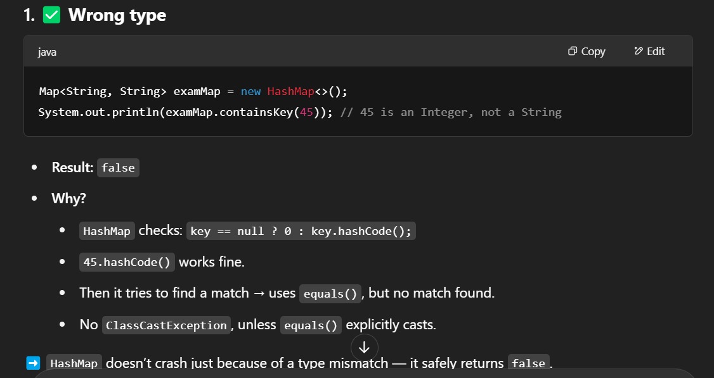
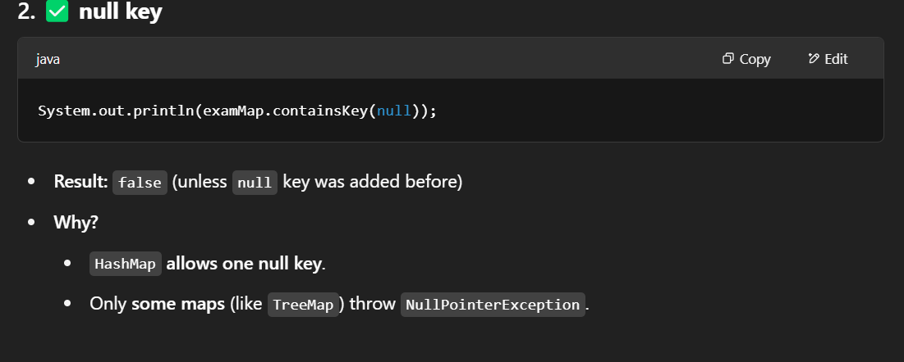
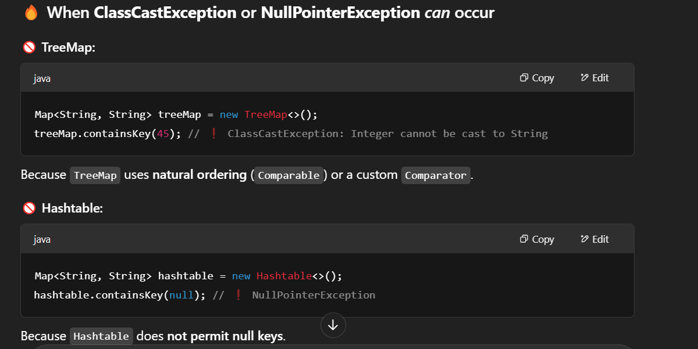

# Map
- Map also provides a method that lets you supply key/value pairs.
  ```java
  Map.ofEntries(
  Map.entry("key1", "value1"),
  Map.entry("key2", "value2"));
  ```
- Now we can’t forget to pass a value. If we leave out a parameter, the entry() method won’t compile.
---
- Map doesn’t extend Collection, more methods are specified on the Map interface.
-  K for key and V for value --> generic type parameters -> Map<K,V>

## HashMap
- A HashMap stores the keys in a hash table.
- It uses the hashCode() method of the keys to retrieve their values more efficiently.

### ✅ Map.containsKey() behavior is safe by design
- Even though the JavaDocs say it may throw ClassCastException or NullPointerException, it's optional and only applies under certain conditions.

- 
- 
- Hashmap 45-i hashCode-a cevirir sonra yoxlayir yeni type erroru cixmir

- 
- TreeMap compare etdiyine gore type-i cast etmek isteyir ve ede bilmir --> ClassCastException


### PROS
- Adding elements and retrieving the element by key both have constant time --> because od hashCode() (explain in HashSet)
- get() ederken eger hashcode-a gore collision olursa bucket-de --> Java uses equals() to find the right key in that bucket. (HashSet-de value-nu yoxlayirde equals() ile)
    ```java
    Map<String, String> map = new HashMap<>();
    map.put("a", "apple");
    map.put("b", "banana");
    // Assume "a" and "b" hash to the same bucket (collision)
    
    map.get("a"); // HashMap will:
                  // 1. Go to bucket via hashCode()
                  // 2. Search the bucket via equals()
    ```
### CONS
- Lose the order in which you inserted the elements. (Hash-e gore) , Most of the time, you aren’t concerned with this in a map anyway. If you were, you could
  use LinkedHashMap

## TreeMap
- TreeMap is sorted. --> Advantage
- Adding and checking whether a key is present takes longer as the tree grows larger --> Disadvantage