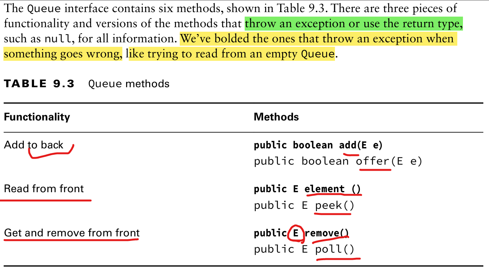
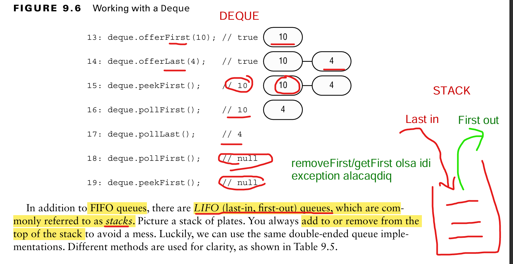

## Queue vs Deque - Core Notes

- **Queue**: FIFO (First-In, First-Out)
    - Elements added at **end**, removed from **front**
    - Example: people lining up to enter a stadium

- **Deque** (Double-Ended Queue):
    - Elements can be added/removed at **both front and back**
    - Useful when flexible insertion/removal is needed

- **Key Concepts**:
    - **Queue** = strict ordering (FIFO)
    - **Deque** = flexible; supports both FIFO and LIFO behaviors

