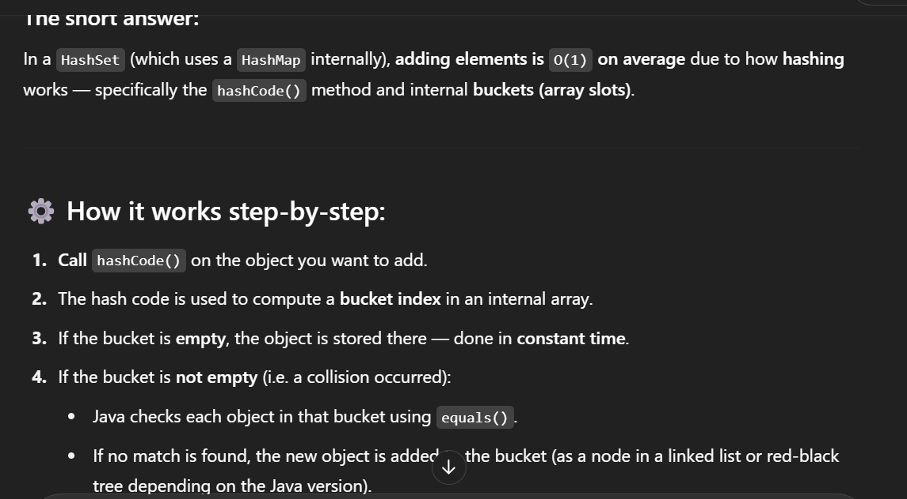
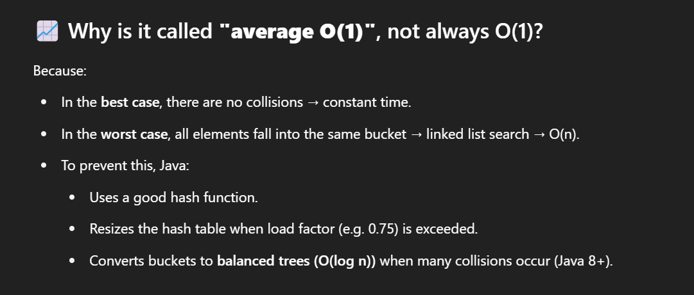

# Set
1. They do not allow duplicates

## HashSet
1.  A HashSet stores its elements in a hash table, keys are a hash, values are an Object.

### PROS
- Adding elements and checking whether an element is in the set --> constant time
- 🔍 How is adding elements to a Set constant time (O(1))?
- 
- ---
- 

### CONS
- You lose the order in which you inserted the elements

### If Collision happened?
- Java’da Set, Map gibi koleksiyonlar içinde bir nesnenin var olup olmadığını anlamak için önce hashCode() sonra gerekirse equals() metodunu kullanır.
- Set, HashMap gibi koleksiyonlar bu değeri kullanarak nesneyi hangi “bucket” yani veri yapısının neresinde tutacağını belirler.
- Hash değerleri int olduğu için, çakışma (collision) mümkündür.
- 1. Java önce hashCode() ile ilgili bucket’ı (veri bölgesi) bulur.
  2. Aynı bucket içinde birden fazla nesne olabilir (çakışmadan dolayı).
  3. Java bu bucket’taki her bir nesneyle equals() metodunu çağırarak eşleşen var mı diye kontrol eder

## TreeSet
1. A TreeSet stores its elements in a sorted tree structure.
2. Numbers implement the Comparable interface in Java, which is used for sorting.

### PROS
- Always in sorted order. 

### CONS
- Adding and checking whether an element exists takes longer than with a HashSet, especially as the tree grows larger.
